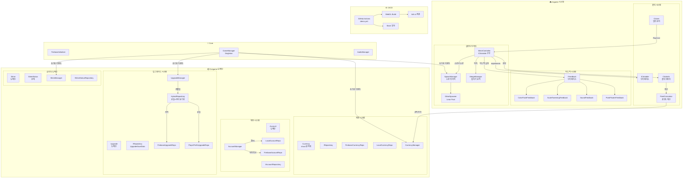
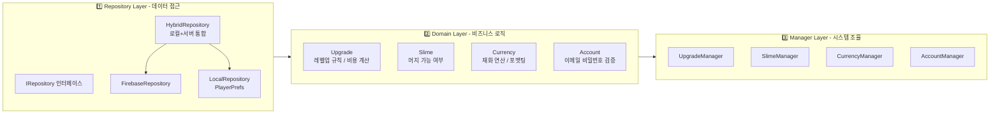
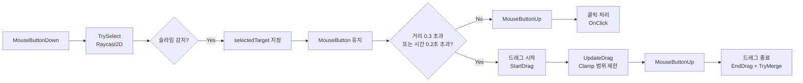
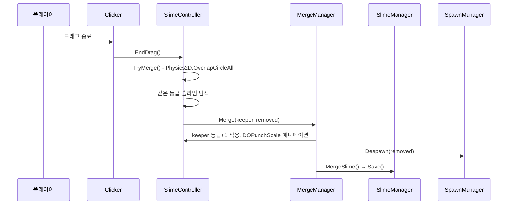
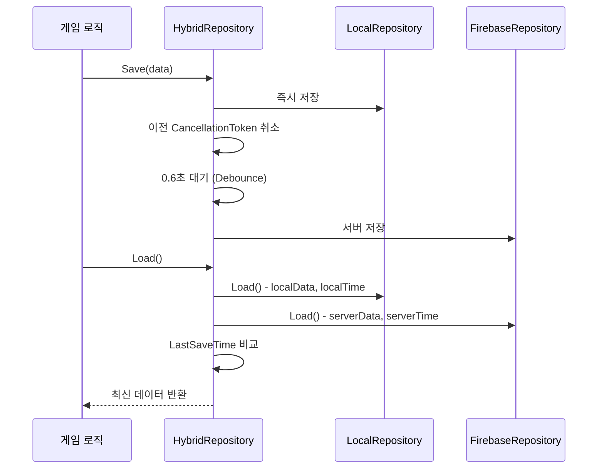
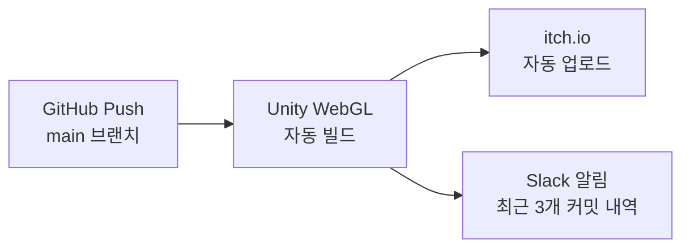

# 🎮 Monster Kindergarten — 정종혁 포트폴리오

> Unity 6 기반 아이들 클리커 게임 | 개발 기간: 2025년 ~ 2026년 2월

---

## 📌 프로젝트 개요

| 항목 | 내용 |
|------|------|
| **엔진** | Unity 6 (6000.3.2f1) |
| **장르** | 아이들 클리커 (Idle Clicker) |
| **빌드 타겟** | WebGL (itch.io 배포) |
| **백엔드** | Firebase Firestore / Firebase Authentication |
| **CI/CD** | GitHub Actions (자동 빌드 → itch.io 업로드) |
| **주요 라이브러리** | DOTween, UniTask, CsvHelper, Lean Pool |

---

## 🗺️ 전체 시스템 구조도



---

## 🏗️ 클린 아키텍처 3층 구조



> 각 Feature(Account, Currency, Upgrade, Slime)는 독립적으로 동일한 3층 구조를 가집니다.
> **Repository**는 저장/로드만, **Domain**은 규칙과 데이터만, **Manager**는 시스템 조율과 외부 통신만 담당해 역할을 명확히 분리했습니다.

---

## ⚙️ 시스템별 상세 설명

---

### 1. GameManager — 전체 초기화 조율

**역할:** 게임 시작 시 여러 Manager의 비동기 데이터 로드가 모두 완료됐는지 이벤트로 감지하고, 완료 시점에 `OnAllDataInitialized`를 발행해 게임 플레이를 시작합니다.

**핵심 구조:**

```
GameManager
├── UpgradeManager.OnDataInitialized 구독
├── SlimeManager.OnDataInitialized 구독
└── CurrencyManager.OnDataInitialized 구독
         ↓ 셋 다 완료 시
    OnAllDataInitialized 발행
         ↓
    SpawnManager → 슬라임 스폰 시작
```

**설계 포인트:**

| 항목 | 내용 |
|------|------|
| **비동기 초기화 감지** | 각 Manager가 독립적으로 로드를 완료하면 이벤트를 쏘고, GameManager가 3개 모두 완료된 시점을 감지 |
| **중복 발행 방지** | `_isAllInitialized` 플래그로 `OnAllDataInitialized`가 한 번만 발행되도록 보장 |
| **이미 초기화된 경우 처리** | `SpawnManager.Start()`에서 `IsAllDataInitialized`를 확인해 타이밍 이슈 방지 |

---

### 2. 클릭 & 드래그 시스템

**역할:** 플레이어의 마우스 입력을 감지하여 슬라임 클릭(포인트 획득)과 드래그(이동 → 머지)를 구분 처리합니다.

**클릭 → 드래그 판단 흐름:**



**ClickInfo 데이터 구조:**

```csharp
public struct ClickInfo
{
    public EClickType ClickType; // Manual(플레이어) / Auto(자동)
    public Vector2   Position;  // 클릭 위치
    public double    Point;     // 획득 포인트 (업그레이드 보너스 포함)
    public ESlimeGrade Grade;   // 슬라임 등급
}
```

**설계 포인트:**

| 항목 | 내용 |
|------|------|
| **이중 임계값 드래그 판단** | 거리(0.3) **또는** 시간(0.2초) 중 하나만 만족해도 드래그로 전환 → 오클릭 방지 |
| **드래그 범위 제한** | `Mathf.Clamp`로 x(-5~5), y(-3~3) 범위 밖으로 이동 불가 |
| **IClickable 인터페이스** | `Clicker`는 구체적인 슬라임 타입을 모르고 `IClickable`만 알면 됨 → 확장 가능 |
| **포인트 계산 분리** | `PointCalculator.Calculate()`를 별도 클래스로 분리해 클릭 로직과 계산 로직 독립 |

**포인트 계산 공식:**

```
최종 포인트 = (슬라임 기본 포인트 + 고정값 보너스) × (1 + 퍼센트 보너스)
```

- 고정값 보너스: `ManualPointPlusAdd` 업그레이드 레벨에서 가져옴
- 퍼센트 보너스: `ManualPointPercentAdd` 업그레이드 레벨에서 가져옴
- Auto 클릭은 각각 `AutoPointPlusAdd`, `AutoPointPercentAdd` 사용

---

### 3. 피드백 시스템

**역할:** 슬라임 클릭 시 발생하는 시각/청각 반응을 독립적인 컴포넌트로 분리해, 새로운 피드백을 코드 수정 없이 추가할 수 있도록 설계했습니다.

**구조:**

```
SlimeController.OnClick(ClickInfo)
    ↓
GetComponentsInChildren<IFeedback>()
    ↓ 자동 검색 후 일괄 실행
    ├── ColorFlashFeedback.Play()    → 스프라이트 색상 0.3초 플래시
    ├── ScaleTweeningFeedback.Play() → DOPunchScale 0.5f 애니메이션
    ├── SoundFeedback.Play()         → 랜덤 피치 효과음 (수동 클릭만)
    └── PointFloaterFeedback.Play()  → 포인트 숫자 플로팅
```

**구현 피드백 상세:**

| 피드백 | 동작 | 특이사항 |
|--------|------|---------|
| **ColorFlashFeedback** | SpriteRenderer 색상을 지정 색으로 바꿨다가 0.3초 후 원복 | 연속 클릭 시 이전 코루틴 중단 후 재시작 |
| **ScaleTweeningFeedback** | DOTween `DOPunchScale(0.5f, 0.5초)` | OnDisable/OnDestroy에서 Tween Kill → 오브젝트 풀링 안전 대응 |
| **SoundFeedback** | 랜덤 인덱스 + 랜덤 피치(0.4~0.8)로 효과음 재생 | `EClickType.Auto`면 재생 안 함 (자동 클릭 소음 방지) |
| **PointFloaterFeedback** | 클릭 위치에 포인트 숫자 스폰 | PointFloaterSpawner를 통해 풀에서 꺼내 사용 |

**설계 포인트:**

| 항목 | 내용 |
|------|------|
| **OCP 준수** | `IFeedback` 구현 컴포넌트를 자식 오브젝트에 붙이기만 하면 자동 인식 → 기존 코드 수정 없이 확장 |
| **컴포넌트 자동 검색** | `GetComponentsInChildren<IFeedback>()`로 수동 등록 불필요 |
| **Auto/Manual 구분** | ClickInfo의 `EClickType`으로 피드백 종류별 조건 분기 가능 |

---

### 4. 슬라임 스폰 & 풀링 시스템

**역할:** 일정 시간마다 슬라임을 자동 스폰하고, Lean Pool을 통해 생성/소멸 비용을 줄입니다. 게임 재시작 시 저장된 슬라임 상태를 그대로 복원합니다.

**스폰 흐름:**

```
SpawnManager.Update()
    ↓ _timer >= _spawnInterval (기본 3초)
    ↓ 활성 슬라임 수 < _maxActiveCount (기본 10)
SpawnManager.Spawn(Grade1)
    ↓
SlimeSpawner.Spawn(grade, randomPos, shouldSave)
    ↓
LeanPool에서 슬라임 오브젝트 꺼내기
    ↓
SlimeController.SetSlime(slime) → 등급 적용
    ↓
DOTween: 위(+3f)에서 목표 위치로 OutBounce 낙하 애니메이션
    ↓
shouldSave == true → SlimeManager.AddSlime(grade) → 저장
```

**게임 재시작 시 복원:**

```csharp
// shouldSave: false → DB에 중복 저장하지 않고 화면에만 복원
foreach (var item in status.ActiveSlimes)
    for (int i = 0; i < item.Value; i++)
        Spawn(item.Key, shouldSave: false);
```

**업그레이드 반영:**

| 업그레이드 타입 | 적용 방식 |
|---------------|---------|
| `SpawnTimeSub` | `_spawnInterval -= 0.1f` (최소 0.5초) |
| `MaxCountAdd` | `_maxActiveCount += 1` |

**설계 포인트:**

| 항목 | 내용 |
|------|------|
| **Lean Pool** | `GameObject.Instantiate/Destroy` 대신 풀에서 꺼내고 반환 → GC 부하 감소 |
| **shouldSave 플래그** | 초기 로드 복원과 신규 스폰을 구분해 DB 중복 쓰기 방지 |
| **OutBounce 낙하** | DOTween Ease로 자연스러운 통통 튀는 낙하 연출 |
| **이벤트 기반 업그레이드 반영** | `UpgradeManager.OnUpgraded` 구독으로 레벨업 즉시 반영 |

---

### 5. 슬라임 머지(합치기) 시스템

**역할:** 드래그 종료 시 같은 등급의 슬라임이 근처에 있으면 자동으로 합쳐 한 등급 높은 슬라임으로 진화시킵니다.

**머지 흐름:**



**머지 판정 로직:**

```csharp
// 반경 0.5f 내 모든 Collider2D 검사
Collider2D[] hits = Physics2D.OverlapCircleAll(transform.position, 0.5f);
foreach (var hit in hits)
{
    SlimeController other = hit.GetComponent<SlimeController>();
    // 자기 자신 제외, 같은 등급인 경우에만 머지
    if (other != null && other != this && other.Grade == this.Grade)
    {
        MergeManager.Instance.Merge(this, other);
        return; // 한 번만 머지
    }
}
```

**설계 포인트:**

| 항목 | 내용 |
|------|------|
| **keeper / removed 역할 분리** | 드래그한 슬라임(keeper)이 등급 상승, 상대방(removed)은 풀로 반환 |
| **CanMerge 검증** | `SlimeManager.CanMerge()`로 최대 등급(Grade10) 초과 머지 방지 |
| **DOPunchScale 연출** | 머지 성공 시 keeper에 `DOPunchScale(1f, 1초)` 적용 |
| **상태 즉시 저장** | `MergeSlime()` 호출로 변경된 슬라임 현황 바로 저장 |

---

### 6. 업그레이드 시스템

**역할:** 포인트를 소모해 슬라임별 클릭 포인트, 스폰 속도, 최대 개체 수 등을 강화하는 콘텐츠입니다. 도메인-매니저 분리로 비즈니스 규칙과 시스템 조율을 독립시켰습니다.

**도메인 클래스 (`Upgrade`):**

```csharp
public class Upgrade
{
    public readonly UpgradeSpecData SpecData; // 기획 데이터 (불변)
    public int Level { get; private set; }   // 런타임 레벨

    // 비용: 기본 비용 + 증가량^레벨 (지수 성장)
    public Currency Cost => SpecData.BaseCost + Math.Pow(SpecData.CostMultiplier, Level);

    // 포인트: Linear(선형) 또는 Fixed(고정) 공식 선택
    public double Point => Level == 0 ? 0 : CalculatePoint(Level);
    public bool IsMaxLevel => Level >= SpecData.MaxLevel;
}
```

**생성자 방어적 검증:**

```csharp
// 잘못된 기획 데이터는 게임 시작 시점에 즉시 예외 발생
if (specData.MaxLevel < 0)   throw new ArgumentException(...);
if (specData.BaseCost <= 0)  throw new ArgumentException(...);
if (specData.BasePoint < 0)  throw new ArgumentException(...);
```

**레벨업 처리 흐름 (`UpgradeManager.TryLevelUp`):**

```
① CurrencyManager.TrySpend(cost)  → 포인트 차감 시도
② Upgrade.TryLevelUp()            → 도메인 레벨 증가
③ 실패 시 포인트 환불             → 원자성 보장
④ Save()                          → HybridRepository 저장
⑤ OnUpgraded(type, grade) 발행    → SpawnManager 등 구독자에게 알림
```

**업그레이드 키 설계:**

```csharp
// Dictionary 키: (업그레이드 타입, 슬라임 등급) 조합
Dictionary<(EUpgradeType, ESlimeGrade), Upgrade> _upgrades;

// 슬라임 공통 업그레이드는 ESlimeGrade.None 사용
Get(EUpgradeType.SpawnTimeSub, ESlimeGrade.None);

// 슬라임별 업그레이드
Get(EUpgradeType.ManualPointPlusAdd, ESlimeGrade.Grade1);
```

**설계 포인트:**

| 항목 | 내용 |
|------|------|
| **도메인-매니저 역할 분리** | `Upgrade`는 비용·포인트 계산만, `UpgradeManager`는 Currency 연동·저장·이벤트 발행 담당 |
| **DIP 준수** | `IRepository<UpgradeSaveData>` 인터페이스에만 의존, 구현체 교체 자유 |
| **도메인 간 침범 방지** | `Upgrade`가 직접 `CurrencyManager`를 참조하지 않고, Manager 단에서 두 도메인을 조율 |
| **포인트 환불 원자성** | 레벨업 실패 시 차감된 포인트를 즉시 환불해 데이터 불일치 방지 |

---

### 7. 재화(Currency) 시스템

**역할:** 게임 내 포인트를 관리하는 시스템입니다. `Currency`를 `struct`(값 타입)로 설계해 음수 불가, 표기법 통일, 연산자 오버로딩을 한 곳에서 강제합니다.

**Currency 도메인 (`struct`):**

```csharp
public readonly struct Currency
{
    public readonly double Value;

    public Currency(double value)
    {
        if (value < 0) throw new Exception("Currency 값은 0보다 작을 수 없습니다.");
        Value = value;
    }

    // ToString 오버라이딩 → 표기법 강제
    public override string ToString() => Value.ToFormattedString();

    // 연산자 오버로딩
    public static Currency operator +(Currency a, Currency b) => new Currency(a.Value + b.Value);
    public static Currency operator -(Currency a, Currency b) => new Currency(a.Value - b.Value);
    public static bool operator >=(Currency a, Currency b) => a.Value >= b.Value;

    // double ↔ Currency 암시적/명시적 변환
    public static implicit operator Currency(double value) => new Currency(value);
    public static explicit operator double(Currency c) => c.Value;
}
```

**숫자 포맷팅 (`NumberFormatExtension`):**

| 값 | 표시 |
|----|------|
| 999 | `999` |
| 1,234 | `1.23K` |
| 12,345,678 | `12.3M` |
| 1,234,567,890 | `1.23B` |

**CurrencyManager 주요 메서드:**

| 메서드 | 동작 |
|--------|------|
| `Get(type)` | 재화 조회 |
| `Add(type, amount)` | 재화 추가 + 이벤트 + 저장 |
| `TrySpend(type, amount)` | 잔액 확인 후 차감 (부족 시 false 반환) |
| `CanAfford(type, amount)` | 소모 가능 여부만 확인 |

**설계 포인트:**

| 항목 | 내용 |
|------|------|
| **struct 선택 이유** | 재화는 값이 중요한 개념 → int/double처럼 값으로 복사·비교되는 struct가 적합 |
| **음수 방지** | 생성자에서 즉시 예외 발생 → 런타임 불일치 데이터 원천 차단 |
| **포맷팅 강제** | `ToString()` 오버라이딩으로 어떤 UI에서 출력해도 동일한 형식 보장 |
| **연산자 오버로딩** | `Currency a + b`, `a >= b` 등 자연스러운 연산 문법 사용 가능 |

---

### 8. 계정(Account) 시스템

**역할:** 로그인/회원가입을 처리하며, 빌드 타겟에 따라 Firebase Auth(네이티브) 또는 PlayerPrefs + SHA256(WebGL)으로 자동 전환됩니다.

**도메인 검증 규칙 (`Account`):**

| 항목 | 규칙 |
|------|------|
| **이메일** | 비어있지 않음 + `AccountEmailSpecification` 형식 검증 |
| **비밀번호** | 비어있지 않음 + 6~15자 |

**레포지토리 자동 전환:**

```csharp
// AccountManager.Awake()
#if !UNITY_WEBGL || UNITY_EDITOR
    _repository = new FirebaseAccountRepository();  // 네이티브: Firebase Auth
#else
    _repository = new LocalAccountRepository();     // WebGL: PlayerPrefs + SHA256
#endif
```

**WebGL 비밀번호 암호화 (`LocalAccountRepository`):**

```csharp
private const string SALT = "sh123";

// 회원가입 시
string hashed = Crypto.HashPassword(password, SALT); // SHA256(password + salt)
PlayerPrefs.SetString(email, hashed);

// 로그인 검증 시
bool valid = Crypto.VerifyPassword(inputPassword, stored, SALT);
```

**로그인 처리 흐름:**

```
AccountManager.TryLogin(email, password)
    ↓
① Account(email, password) 생성 → 도메인 유효성 검증
② _repository.Login() → Firebase or Local 처리
③ 성공 시 LoggedInEmail 저장
④ AccountResult 반환 (Success, ErrorMessage)
```

**Specification Pattern (`AccountEmailSpecification`):**

```
이메일 검증 규칙을 별도 클래스로 분리
→ 검증 로직 재사용 가능
→ 규칙 변경 시 Specification 클래스만 수정
```

**설계 포인트:**

| 항목 | 내용 |
|------|------|
| **조건부 컴파일** | WebGL은 Firebase 미지원 → `#if` 분기로 자동 대체 구현 적용 |
| **SHA256 + Salt** | WebGL에서도 평문 비밀번호 저장 방지 |
| **도메인 분리** | 유효성 검증은 `Account` 도메인에서, 저장소 통신은 `AccountManager`에서 |
| **Specification Pattern** | 이메일 검증 규칙을 별도 클래스로 분리해 재사용성 향상 |

---

### 9. HybridRepository — 저장 전략

**역할:** 로컬(PlayerPrefs)과 서버(Firebase)를 동시에 관리하는 저장 계층입니다. 빠른 로컬 저장으로 응답성을 유지하면서, Debounce 전략으로 불필요한 서버 요청을 줄입니다.

**Save 흐름:**



**Debounce 구현:**

```csharp
public async UniTask Save(T saveData)
{
    // 1. 로컬은 즉시 저장
    saveData.LastSaveTime = DateTime.UtcNow.ToString("O");
    await _playerprefsRepository.Save(saveData);

    // 2. 이전 서버 저장 요청 취소 (Debounce)
    _firebaseSaveToken?.Cancel();
    _firebaseSaveToken?.Dispose();
    _firebaseSaveToken = new CancellationTokenSource();

    SaveToFirebase(saveData, _firebaseSaveToken.Token).Forget();
}

private async UniTaskVoid SaveToFirebase(T saveData, CancellationToken token)
{
    await UniTask.Delay(TimeSpan.FromSeconds(0.6f), cancellationToken: token);
    if (!token.IsCancellationRequested)
        await _firebaseRepository.Save(saveData);  // 마지막 요청만 실제 저장
}
```

**Load 충돌 해결:**

```csharp
// 로컬과 서버를 동시에 로드 (WhenAll)
var (localData, serverData) = await UniTask.WhenAll(localTask, serverTask);

// LastSaveTime ISO 8601 비교 → 더 최신 데이터 사용
if (localTime >= serverTime) return localData;
else
{
    // 서버가 더 최신이면 로컬에도 동기화
    _playerprefsRepository.Save(serverData).Forget();
    return serverData;
}
```

**설계 포인트:**

| 항목 | 내용 |
|------|------|
| **Debounce (0.6초)** | 연속 저장 시 서버 요청 최소화 — 마지막 1회만 실제 저장 |
| **CancellationToken** | 이전 대기 중인 서버 저장을 안전하게 취소 |
| **WhenAll 병렬 로드** | 로컬과 서버를 동시 로드 후 비교 → 대기 시간 최소화 |
| **LastSaveTime 기반** | ISO 8601 포맷으로 정확한 시간 비교, 오프라인 플레이 후 동기화 안전 |
| **서버 null 처리** | 신규 유저거나 서버 저장 없는 경우 로컬 데이터 반환 |

---

### 10. CI/CD 파이프라인

**역할:** main 브랜치에 Push 시 Unity WebGL 빌드를 자동화하고 itch.io에 배포하며, 결과를 Slack으로 알립니다.



**워크플로우 구성 요소:**

| 단계 | 내용 |
|------|------|
| **트리거** | `main` 브랜치 Push 시 자동 실행 |
| **Unity 빌드** | Ubuntu 환경에서 WebGL 타겟 빌드 |
| **itch.io 업로드** | `butler` CLI로 빌드 결과물 자동 배포 |
| **Slack 알림** | 빌드 성공/실패 여부 + 최근 3개 커밋 내역 전송 |
| **Gemini 코드 리뷰** | PR 생성 시 AI 코드 리뷰 자동 실행 (테스트) |

**주요 설정 특이사항:**

- WebGL 빌드 시 Firebase SDK 미포함 처리 (조건부 컴파일 `#if !UNITY_WEBGL`)
- 빌드 시간 최적화를 위한 캐시 전략 적용
- Slack 알림에 변경 내역 3개 제한 + 줄바꿈 포맷 정리

---

### 11. WebAPI 학습 모듈

**역할:** `UnityWebRequest`, OpenWeatherMap API, CSV 파싱 등 외부 API 연동 방법을 학습한 예제 모음입니다.

**CSV 파싱 예제 (`CsvHelper` + Attribute 매핑):**

```csharp
[Name("id")]   public int    Id   { get; set; }
[Name("name")] public string Name { get; set; }
[Name("age")]  public int    Age  { get; set; }

// BOM 제거 후 파싱
result = result.TrimStart('\uFEFF');
var csv = new CsvReader(new StringReader(result), config);
List<Person> people = csv.GetRecords<Person>().ToList();
```

**학습 내용 요약:**

| 파일 | 학습 포인트 |
|------|-----------|
| `WebGetTextTest` | `UnityWebRequest.Get()` 기본 사용법 |
| `WebGetWeatherTest` | REST API 호출 + `JsonUtility` JSON 역직렬화 |
| `WebGetImageTest` | 바이너리 응답 → `Texture2D` 변환 → `RawImage` 표시 |
| `WebGetStudentCSVTest` | CSV BOM 처리 + `CsvHelper` Attribute 기반 자동 매핑 |

---

## 📐 설계 패턴 정리

| 패턴 | 적용 위치 | 목적 |
|------|----------|------|
| **Singleton** | 모든 Manager | 전역 단일 접근 |
| **Repository** | 데이터 저장/로드 전체 | 저장소 구현체 추상화 |
| **Domain Model** | Upgrade, Slime, Currency | 비즈니스 규칙 응집 |
| **Observer (Event)** | Manager 간 통신 | 느슨한 결합 |
| **Object Pool** | SlimeSpawner (Lean Pool) | GC 부하 감소 |
| **Value Object** | Currency (struct) | 불변 값 보장 |
| **Specification** | AccountEmailSpecification | 검증 규칙 분리 |
| **Strategy** | PointFormula (Linear/Fixed) | 계산 공식 교체 가능 |
| **Hybrid Pattern** | HybridRepository | 로컬+서버 통합 저장 |

---

## ✅ 장점 / 특징

### 아키텍처 측면
- **Clean Architecture 적용** — Repository / Domain / Manager 3층 분리로 관심사 명확
- **DIP 준수** — 구현체가 아닌 `IRepository<T>` 인터페이스에만 의존 → 구현체 교체 자유
- **이벤트 기반 통신** — `OnUpgraded`, `OnDataChanged` 등으로 시스템 간 결합도 최소화
- **조건부 컴파일** (`#if !UNITY_WEBGL`) — 빌드 타겟별 구현체 자동 교체, 코드 분기 없이 동작

### 저장 시스템 측면
- **HybridRepository Debounce** — 빠른 연속 저장 시 서버 요청 최소화 (CancellationToken 활용)
- **LastSaveTime 기반 최신 데이터 선택** — 오프라인 플레이 후 재접속 시 데이터 손실 없이 동기화
- **SHA256 + Salt 암호화** — WebGL 환경에서도 비밀번호 평문 저장 방지

### 게임플레이 측면
- **드래그 이중 임계값 판단** — 시간/거리 중 하나 충족 시 드래그 전환 → 의도치 않은 드래그 방지
- **Object Pool (Lean Pool)** — 슬라임 생성/소멸 시 GC 부하 제거
- **shouldSave 플래그** — 초기 복원과 신규 스폰을 구분해 DB 중복 쓰기 방지
- **포인트 환불 원자성** — 레벨업 실패 시 차감된 포인트 즉시 환불

---

## ⚠️ 한계 / 개선 가능 지점

| 항목 | 현황 | 개선 방향 |
|------|------|----------|
| **Manager 싱글턴 직접 참조** | 모든 Manager가 `Instance`로 상호 참조 | Zenject 등 DI 컨테이너 도입 고려 |
| **ScriptableObject 의존** | SlimeSpecTable을 에디터 SO로 관리 | Addressables + 서버 Config 전환 가능 |
| **Firebase WebGL 미지원** | WebGL에서 Firebase 대신 LocalRepo 사용 | PlayFab 등 WebGL 지원 BaaS 전환 고려 |
| **GitHub Actions 미완성** | demo.yml 기본 뼈대만 존재 | GameCI 액션으로 실제 자동 빌드 완성 필요 |
| **API KEY 하드코딩** | WebAPI 튜토리얼에 키 노출 | GitHub Secrets 또는 환경변수 분리 필요 |

---

## 🔑 핵심 코드 하이라이트

### HybridRepository — Debounce 저장 전략

```csharp
public async UniTask Save(T saveData)
{
    saveData.LastSaveTime = DateTime.UtcNow.ToString("O");
    await _playerprefsRepository.Save(saveData); // 로컬 즉시 저장

    _firebaseSaveToken?.Cancel();
    _firebaseSaveToken?.Dispose();
    _firebaseSaveToken = new CancellationTokenSource();
    SaveToFirebase(saveData, _firebaseSaveToken.Token).Forget();
}

private async UniTaskVoid SaveToFirebase(T saveData, CancellationToken token)
{
    try
    {
        await UniTask.Delay(TimeSpan.FromSeconds(0.6f), cancellationToken: token);
        if (!token.IsCancellationRequested)
            await _firebaseRepository.Save(saveData);
    }
    catch (OperationCanceledException) { } // 이전 요청 폐기
    catch (Exception e) { Debug.Log($"파이어베이스 저장 실패: {e.Message}"); }
}
```

### Upgrade — 도메인 계산 로직

```csharp
// 비용: 지수 성장 (레벨이 오를수록 급격히 상승)
public Currency Cost => SpecData.BaseCost + Math.Pow(SpecData.CostMultiplier, Level);

// 포인트: Linear(선형) 또는 Fixed(고정) 전략 패턴
private double CalculatePoint(int level) => SpecData.PointFormula switch
{
    EPointFormula.Fixed => SpecData.BasePoint,
    _                   => SpecData.BasePoint + level * SpecData.PointMultiplier,
};
```

### Currency — 값 객체 패턴

```csharp
public readonly struct Currency
{
    public Currency(double value)
    {
        if (value < 0) throw new Exception("Currency 값은 0보다 작을 수 없습니다.");
        Value = value;
    }
    public override string ToString() => Value.ToFormattedString(); // 1234567 → "1.2M"
    public static Currency operator +(Currency a, Currency b) => new(a.Value + b.Value);
    public static implicit operator Currency(double value) => new(value);
}
```

### PointCalculator — 업그레이드 보너스 적용

```csharp
public static double Calculate(double basePoint, ESlimeGrade grade, EClickType clickType)
{
    double flatBonus    = GetFlatBonus(grade, clickType);    // 고정값 보너스
    double percentBonus = GetPercentBonus(grade, clickType); // 퍼센트 보너스
    return (basePoint + flatBonus) * (1 + percentBonus);
}
```

### Clicker — 드래그 이중 임계값 판단

```csharp
float distance  = Vector2.Distance(_mouseDownPos, currentPos);
float heldTime  = Time.time - _mouseDownTime;

if (distance > _dragThresholdDistance || heldTime > _dragThresholdTime)
{
    _isDragging = true;
    _selectedTarget.StartDrag();
}
```

---

## 📋 커밋 히스토리 — 개발 흐름 요약

| 단계 | 주요 커밋 | 내용 |
|------|----------|------|
| 1️⃣ **기반 구축** | `feat : 클리커게임 기본 뼈대 구성` | GameManager, 기본 클릭 시스템, DoTween/CoffeeUI 추가 |
| 2️⃣ **드래그 & 머지** | `feat : 드래그 앤 드랍 추가, 몬스터 합치기 추가` | SlimeController, MergeManager, 슬라임 에셋 |
| 3️⃣ **슬라임 이미지** | `feat : 레벨 별 이미지 추가`, `feat : 클릭 시 이펙트 추가` | Grade별 스프라이트, 피드백 시스템 |
| 4️⃣ **포인트 시스템** | `feat : 레벨 별 포인트 변경`, `feat : 데미지→포인트 명칭 수정` | PointCalculator, 자동 클릭 |
| 5️⃣ **업그레이드 도메인** | `feat : 업그레이드 도메인 설계` | Upgrade, UpgradeSpecData, 검증 로직 |
| 6️⃣ **업그레이드 UI** | `feat : 업그레이드 UI 연동`, `feat : 업그레이드 통합` | UpgradePanel, UpgradeItem, UpgradeManager |
| 7️⃣ **Firebase 연동** | `feat : 파이어베이스 연동 + 튜토리얼` | 로그인, CRUD, Repository 패턴 완성 |
| 8️⃣ **재화/계정** | `feat : Upgrade, Currency, Account 파이어베이스 연동 완료` | HybridRepository, Crypto, 조건부 컴파일 |
| 9️⃣ **슬라임 현황** | `feat : 슬라임 현황 정보 저장 및 리팩토링` | SlimeStatus, SlimeManager, 상태 저장 |
| 🔟 **리팩토링** | `refactor : 코드 리뷰 리팩토링`, `feat : HybridRepository 적용` | 클린 아키텍처 완성, DIP 적용 |
| 1️⃣1️⃣ **CI/CD** | `chore : Add demo.yml`, `actions: WebGL 대응 빌드 워크플로우` | GitHub Actions, itch.io 배포, Slack 알림 |
| 1️⃣2️⃣ **WebAPI** | `feat : CSV 파싱`, `feat : WebAPI` | CsvHelper, OpenWeatherMap API, 이미지 다운로드 |

---

## 🛠️ 사용 기술 스택

```
Unity 6 (6000.3.2f1)
├── C# / UniTask (비동기 처리)
├── DOTween (트위닝 애니메이션)
├── Lean Pool (오브젝트 풀링)
├── TextMesh Pro (UI 텍스트)
└── UIEffect (UI 이펙트)

Firebase
├── Firebase Authentication (계정 관리)
└── Firebase Firestore (클라우드 저장)

CI/CD
├── GitHub Actions (자동 빌드)
├── itch.io 자동 배포 (butler)
└── Slack 알림 연동

기타
├── CsvHelper (CSV 파싱)
└── SHA256 + Salt 암호화 (WebGL 계정 보안)
```

---

> 작성자: 정종혁 (GitHub: jjh770)
> 프로젝트: Monster Kindergarten
> 날짜: 2026년 2월
